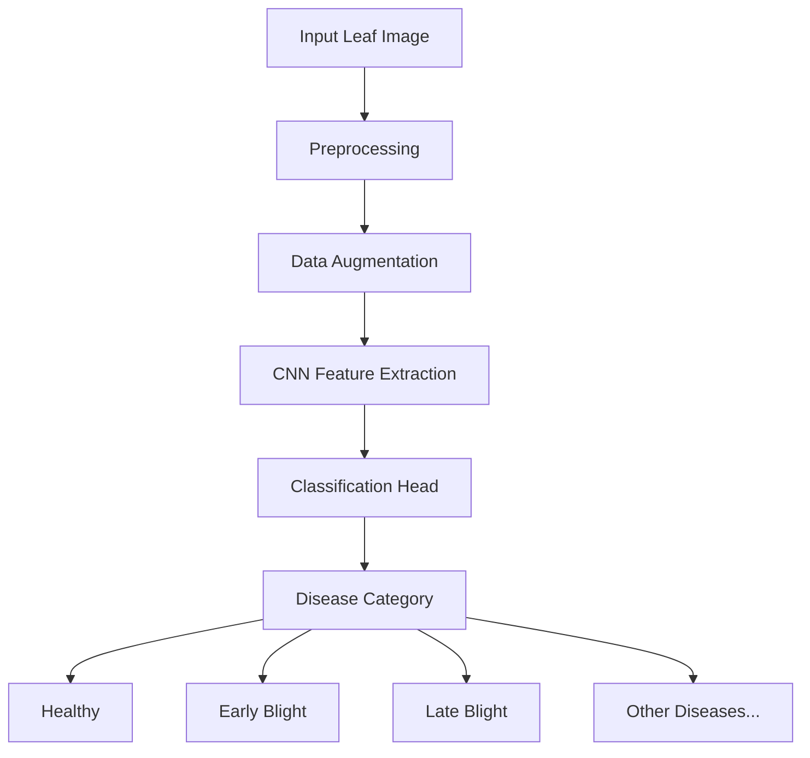

# 🌾 Crop Disease Detection — Computer Vision with CNN

[](https://python.org)
[]()
[](https://scikit-learn.org)
[](LICENSE)

> A deep learning system for automated multi-class plant disease detection from leaf images using Convolutional Neural Networks (CNNs). Trained on labelled agricultural image datasets with data augmentation to improve generalisation.

---

## 📋 Table of Contents

- [Overview](#overview)
- [Computer Vision Approach](#computer-vision-approach)
- [CNN Pipeline](#cnn-pipeline)
- [Image Preprocessing](#image-preprocessing)
- [Data Augmentation](#data-augmentation)
- [Model Evaluation](#model-evaluation)
- [Project Structure](#project-structure)
- [Setup & Installation](#setup--installation)
- [Future Improvements](#future-improvements)
- [Roadmap](#roadmap)
- [Technologies Used](#technologies-used)

---

## 🔍 Overview

Crop diseases cause significant agricultural losses worldwide. Early and accurate detection enables farmers to take timely action, reducing crop loss and pesticide overuse. This system automates plant disease identification from smartphone photos of leaves, making it accessible to farmers without laboratory access.

**Task**: Multi-class image classification of plant leaf diseases
**Input**: RGB images of plant leaves
**Output**: Disease category label + confidence score

---

## 👁️ Computer Vision Approach



The CNN learns hierarchical visual features:
- **Low-level**: Edges, textures, color gradients
- **Mid-level**: Spots, lesion patterns, discolouration regions
- **High-level**: Disease-specific visual signatures

---

## 🧠 CNN Pipeline


**Architecture Choices:**
- **ReLU activations** — Fast training, avoids vanishing gradients
- **Max Pooling** — Spatial downsampling for translation invariance
- **Dropout** — Regularisation to prevent overfitting
- **Softmax output** — Probability distribution over disease classes
- **GlobalAveragePooling** — Parameter reduction vs. Flatten

---

## 🖼️ Image Preprocessing

All input images are preprocessed through a standardised pipeline before training or inference:

| Step | Operation | Value |
|------|-----------|-------|
| Resize | Bicubic interpolation | 224 × 224 pixels |
| Normalize | Per-channel mean subtraction | ImageNet mean |
| Convert | RGB channel ordering | (R, G, B) |
| Type cast | Float conversion | float32 |

**Data Cleaning:**
- Removed corrupted or unreadable images
- Filtered images with extreme lighting artefacts
- Verified label consistency across dataset splits

---

## 🔄 Data Augmentation

Data augmentation artificially expands the training set to improve generalisation:

```python
# Augmentation pipeline applied during training
augmentation_transforms = [
    RandomHorizontalFlip(p=0.5),
    RandomVerticalFlip(p=0.3),
    RandomRotation(degrees=30),
    ColorJitter(brightness=0.2, contrast=0.2, saturation=0.2),
    RandomCrop(size=200, padding=12),
]
```

**Why augmentation?**
- Disease images vary in lighting, angle, and background
- Reduces overfitting on limited labelled data
- Improves model robustness to real-world conditions

---

## 📊 Model Evaluation

Models are evaluated using the following metrics (reported on held-out test set):

| Metric | Description |
|--------|-------------|
| **Precision** | True Positives / (True Positives + False Positives) per class |
| **Recall** | True Positives / (True Positives + False Negatives) per class |
| **F1-Score** | Harmonic mean of Precision and Recall |
| **Confusion Matrix** | Visual breakdown of per-class prediction accuracy |

**Regularisation strategies applied:**
- Dropout layers (p=0.3–0.5) to reduce overfitting
- L2 weight regularisation on Dense layers
- Early stopping based on validation loss
- Learning rate scheduling

---

## 📁 Project Structure

```
Crop-Disease-Detection/
├── README.md
├── requirements.txt
├── training/
│   └── train.py                  # Full CNN training script
├── dataset/
│   ├── README.md                 # Dataset download instructions
│   └── (place dataset splits here)
├── notebooks/
│   └── 01_cnn_pipeline.ipynb     # End-to-end walkthrough notebook
├── screenshots/
│   └── (model outputs, confusion matrix plots)
└── docs/
    └── architecture.md
```

---

## 🚀 Setup & Installation

```bash
git clone https://github.com/umeshpandeysh/Crop-Disease-Detection.git
cd Crop-Disease-Detection

python -m venv venv
venv\Scripts\activate
pip install -r requirements.txt

# Run the training notebook
jupyter notebook notebooks/01_cnn_pipeline.ipynb

# Or run training directly
python training/train.py
```

---

## 🔭 Future Improvements

- [ ] Transfer learning from EfficientNet or ResNet for higher accuracy
- [ ] Real-time inference on mobile with TensorFlow Lite export
- [ ] Web application for farmers to upload and get instant diagnosis
- [ ] Expand dataset to cover more crop species and disease variants
- [ ] Add Grad-CAM visualisations to show which leaf regions triggered detection
- [ ] Ensemble CNN predictions with traditional ML features for improved robustness

---

## 🗺️ Roadmap

| Phase | Status | Description |
|-------|--------|-------------|
| Phase 1: Data Pipeline | ✅ Complete | Preprocessing, augmentation, loader |
| Phase 2: CNN Training | ✅ Complete | Model training with regularisation |
| Phase 3: Evaluation | ✅ Complete | Precision, Recall, F1, Confusion Matrix |
| Phase 4: Transfer Learning | 🔄 In Progress | EfficientNet fine-tuning |
| Phase 5: Mobile Deployment | 📋 Planned | TFLite export for Android |

---

## 🛠️ Technologies Used

| Category | Tools |
|----------|-------|
| **Language** | Python 3.10+ |
| **Deep Learning** | PyTorch / TensorFlow (Keras) |
| **ML** | Scikit-learn (metrics, preprocessing) |
| **Data** | NumPy, Pandas, Pillow |
| **Visualization** | Matplotlib, Seaborn |
| **Notebooks** | Jupyter |

---

## 📄 License

MIT License — see [LICENSE](LICENSE) for details.

---

<div align="center">

**Crop Disease Detection** | Built by [Umesh Pandey](https://github.com/umeshpandeysh)

</div>
